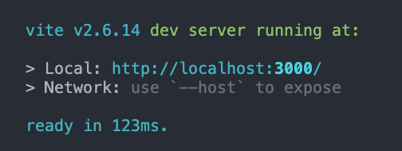

# @arco-design Pro minimal starter with Vite.js, React.js, Typescript

Fastest Dashboard project starter.
================================================

## Features

- [x] Lightweight
- [x] Styles & icons import on-demand
- [x] Remove i18n
- [x] Remove theme settings
- [x] React.js + Typescript
- [x] Lazy-load
- [ ] React-redux
- [ ] React router v6
- [ ] Unit tests


## Dev server launch in sub second

Thanks to Vite.js and esbuild, the dev server starts in 100ms.




## Bundle size optimized

The build process takes only 4s+ (for this starter, this number will grow if your project is getting larger)

With only 1 welcome page & 1 table page, the output bundle size is around 300kb: 

```shell
➜  arco-design-pro-vite-react-ts-starter git:(master) ✗ yarn build
yarn run v1.22.15
$ vite build
vite v2.6.14 building for production...
transforming (1057) node_modules/focus-lock/dist/es2015/utils/tabUtils.jsUse of eval is strongly discouraged, as it poses security risks and may cause issues with minification
✓ 1090 modules transformed.
dist/assets/favicon.17e50649.svg      1.49 KiB
dist/index.html                       0.52 KiB
dist/assets/index.4bb7199c.js         0.54 KiB / gzip: 0.32 KiB
dist/assets/index.e562108c.css        0.09 KiB / gzip: 0.09 KiB
dist/assets/index.2b00c2ba.js         2.58 KiB / gzip: 1.15 KiB
dist/assets/index.c27325d6.css        3.57 KiB / gzip: 0.88 KiB
dist/assets/index.6abe120e.css        35.61 KiB / gzip: 5.16 KiB
dist/assets/index.f495d1c7.css        233.00 KiB / gzip: 27.93 KiB
dist/assets/index.44900b5c.js         366.08 KiB / gzip: 109.50 KiB
dist/assets/arco-design.601117f2.js   598.11 KiB / gzip: 169.93 KiB

(!) Some chunks are larger than 500 KiB after minification. Consider:
- Using dynamic import() to code-split the application
- Use build.rollupOptions.output.manualChunks to improve chunking: https://rollupjs.org/guide/en/#outputmanualchunks
- Adjust chunk size limit for this warning via build.chunkSizeWarningLimit.
✨  Done in 4.61s.
```

## Theming

checkout `vite.config.ts` css object.

```ts
css: {
    preprocessorOptions: {
        less: {
            javascriptEnabled: true,
            // Customize stylings here
            modifyVars: {
                // arcoblue-6 is the primary-color :)))
                "arcoblue-6": "#1DA57A",
            },
        },
    },
},
```

## Icons and styles imported on-demand

checkout `vite.config.ts` plugins object.

```ts
plugins: [
    styleImport({
        libs: [
            // Dynamic import @arco-design styles
            {
                libraryName: "@arco-design/web-react",
                libraryNameChangeCase: "pascalCase",
                esModule: true,
                resolveStyle: (name) =>
                    `@arco-design/web-react/es/${name}/style/index`,
            },
            // Dynamic import @arco-design icons
            {
                libraryName: "@arco-design/web-react/icon",
                libraryNameChangeCase: "pascalCase",
                resolveStyle: (name) =>
                    `@arco-design/web-react/icon/react-icon/${name}`,
                resolveComponent: (name) =>
                    `@arco-design/web-react/icon/react-icon/${name}`,
            },
        ],
    }),
]
```

## Others

this repo is minimized to help you understand how it works, just focus on `vite.config.ts`.

Your star is appreciated.